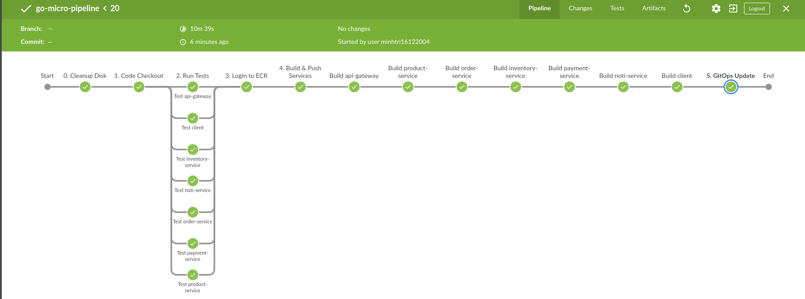
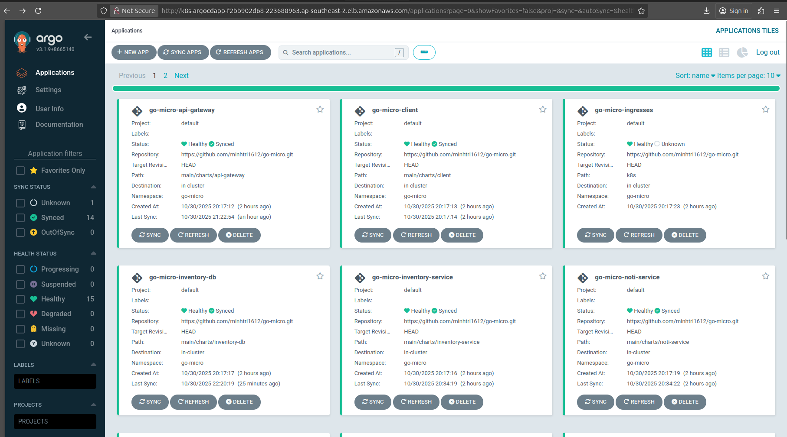
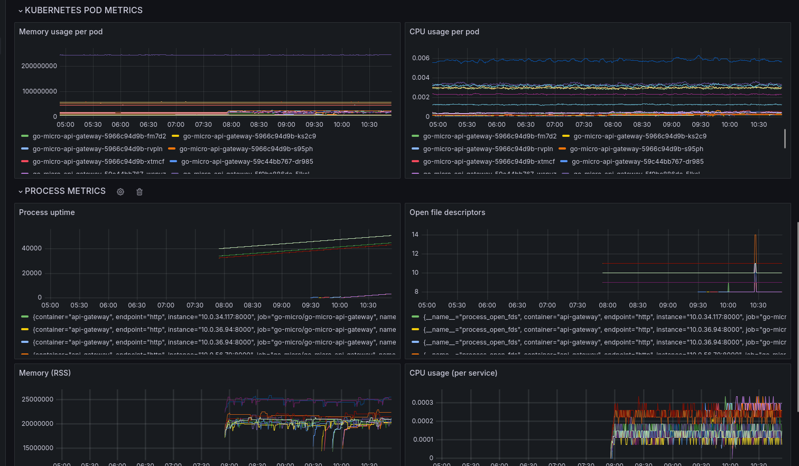

# Go Microservices E‑Commerce on AWS EKS

A production‑style microservices platform built with Go and deployed to AWS EKS. It features Jenkins‑driven CI/CD, ArgoCD GitOps, Helm umbrella charts, ALB ingress, and fully automated infrastructure with Terraform.



## Architecture Overview

Services: `api-gateway`, `product-service`, `order-service`, `inventory-service`, `notification-service`.

- API Gateway exposes `/api/v1/*` and fan‑outs to services.
- Each service has its own PostgreSQL DB; Redis used for caching; RabbitMQ for async events.
- Order service includes circuit breaker, retries, worker‑pool batch processing.

## Cloud & Platform

- AWS EKS cluster provisioned with Terraform (VPC/subnets, IAM, node groups, ECR, ALB controller, security).
- Helm umbrella chart (13 subcharts) deploys app services + data stores (PostgreSQL per service, Redis, RabbitMQ).
- Ingress via AWS Load Balancer Controller (ALB). Client and API paths are publicly reachable.
- Bash automation: `deploy-to-eks.sh` (umbrella release, secrets bootstrap via `main/scripts/create-secrets.sh`).

## GitOps & CI/CD



- Jenkins (multibranch + shared library) builds/tests, pushes images to ECR, and updates Helm/Git for release.
- ArgoCD manages Kubernetes state declaratively with Applications per component; automated sync + self‑healing.
- Separate ArgoCD app manifests for each service/db and shared components (client, gateway, ingress).

## Quick Start (EKS)

1) Build & push images (Jenkins pipeline or locally), then run:
```bash
./deploy-to-eks.sh
```
2) Open the ALB DNS from:
```bash
kubectl get ingress -n go-micro -o wide
```

## API Highlights

- API Gateway: `/api/v1/products`, `/api/v1/orders`, `/api/v1/inventory`, `/api/v1/notifications`, `/health`.
- Order service: create order, batch orders with worker pool, Redis caching, RabbitMQ event publish.

## Environment (Order Service)

`DB_HOST`, `DB_PORT`, `DB_USER`, `DB_PASSWORD`, `DB_NAME`, `REDIS_HOST`, `RABBITMQ_HOST`, `INVENTORY_SERVICE_URL`, `NOTIFICATION_SERVICE_URL`.

## Repo Scripts

- `deploy-to-eks.sh` – deploy umbrella chart and create secrets.
- `main/scripts/create-secrets.sh` – idempotent app/DB secrets.
- `terraform/scripts/jenkins-install.sh`, `terraform/scripts/tools-install.sh` – Jenkins and tools bootstrap.

## Project Highlights

✨ **Key Features**:
- Microservices-based architecture with independent scaling
- Real-time order processing with Redis caching
- Asynchronous communication via RabbitMQ
- Comprehensive API documentation with Swagger
- Automated CI/CD pipeline with Jenkins
- Container orchestration with Kubernetes
- Advanced monitoring with Prometheus & Grafana

🛠️ **Tech Stack**:
- Go + Gin Framework
- PostgreSQL + Redis
- RabbitMQ
- Docker & Kubernetes
- Prometheus & Grafana
- Jenkins


## Architecture

The project consists of the following microservices:

- **API Gateway** (Port: 8000): Single entry point for all client requests
- **Product Service** (Port: 8080): Product management
- **Order Service** (Port: 8081): Order processing with caching and message queue
- **Inventory Service** (Port: 8082): Inventory management
- **Notification Service** (Port: 8083): Notification handling

### Technologies Used

- **Go**: Primary programming language
- **Gin**: Web framework
- **PostgreSQL**: Primary database
- **Redis**: Caching layer
- **RabbitMQ**: Message queue
- **Docker & Docker Compose**: Containerization and orchestration
- **Prometheus & Grafana**: Monitoring and metrics
- **Circuit Breaker**: Fault tolerance handling
- **Swagger/OpenAPI**: API Documentation
- **Postman**: API Testing

## Key Features

### API Gateway
- Single entry point for all client requests
- Intelligent request routing
- CORS support
- Automatic API documentation
- Health check endpoints

### Order Service
- **Redis Caching**:
  - Order caching with 30-minute TTL
  - Automatic cache invalidation
  - Cache-aside pattern implementation

- **RabbitMQ Message Queue**:
  - Event publishing for new orders
  - Topic exchange for order events
  - Asynchronous notification processing

- **Batch Processing**:
  - Parallel processing of multiple orders
  - Configurable worker pool
  - Timeout handling
  - Success/failure tracking
  - Performance optimization for bulk operations

- **Resilience**:
  - Circuit breaker for service calls
  - Retry mechanism
  - Async notification handling
  - Error handling and logging

### Database
- PostgreSQL for each service
- Separate databases for isolation
- Optimized queries and indexing

### Monitoring
- Prometheus metrics
- Grafana dashboards
- Service health monitoring
- Performance metrics

## Installation and Running

1. Clone repository:
\`\`\`bash
git clone <repository-url>
cd go-microservices
\`\`\`

2. Run services with Docker Compose:
\`\`\`bash
docker-compose up --build
\`\`\`

3. Check services:
- API Gateway: http://localhost:8000
- Product Service: http://localhost:8080
- Order Service: http://localhost:8081
- Inventory Service: http://localhost:8082
- Notification Service: http://localhost:8083
- Prometheus: http://localhost:9090
- Grafana: http://localhost:3000

## API Endpoints

### API Gateway (http://localhost:8000)
- `/api/v1/products/*`: Product service endpoints
- `/api/v1/orders/*`: Order service endpoints
- `/api/v1/inventory/*`: Inventory service endpoints
- `/api/v1/notifications/*`: Notification service endpoints
- `/health`: Health check endpoint
- `/docs`: API documentation

### Order Service (http://localhost:8081)
- `POST /orders`: Create new order
  - Inventory check
  - Cache result
  - Publish event to RabbitMQ
  - Async notification
- `POST /orders/batch`: Process multiple orders in parallel
  - Concurrent processing using worker pool
  - Configurable number of workers
  - Timeout handling
  - Detailed success/failure tracking
- `GET /orders/:id`: Get order details (with Redis cache)
- `GET /orders`: List all orders
- `PUT /orders/:id`: Update order
- `DELETE /orders/:id`: Delete order
- `PATCH /orders/:id/status`: Update order status

## Batch Processing

### Features
- Parallel processing of large order volumes
- Configurable worker pool size (default: 10 workers)
- Timeout handling (default: 30 seconds)
- Detailed success/failure tracking
- Performance optimization

### Example Request
\`\`\`bash
curl -X POST http://localhost:8081/orders/batch \
  -H "Content-Type: application/json" \
  -d '[
    {
      "product_id": 1,
      "customer_id": 1,
      "quantity": 2
    },
    {
      "product_id": 2,
      "customer_id": 1,
      "quantity": 1
    }
    // ... more orders ...
  ]'
\`\`\`

### Example Response
\`\`\`json
{
  "total_orders": 1000,
  "successful": 990,
  "failed": 10,
  "failed_orders": [
    {
      "order_id": 5,
      "error": "Product not available"
    }
  ],
  "processing_time": "30s"
}
\`\`\`

### Performance
- Processing capacity: Up to 1000 orders/minute
- Average processing time: ~100ms per order
- Concurrent processing: 10 orders at a time
- Automatic timeout after 30 seconds

## Monitoring

### Prometheus Metrics
- Order processing time
- Cache hit/miss ratio
- Message queue performance
- Batch processing metrics
- Service health metrics

### Grafana Dashboards
- Service performance monitoring
- Error rate tracking
- Resource utilization
- Business metrics

### Prometheus & Grafana Stack
Prometheus scrapes labeled metrics from every microservice, stores them as time-series data, and powers alert rules that surface anomalies before they impact customers. Grafana sits on top of Prometheus to turn those metrics into actionable dashboards, drill-down visualizations, and SLA tracking so operators can correlate spikes, outages, and business KPIs in a single place. Together they provide unified observability across the entire platform, from infrastructure to application-level performance.



## Environment Variables

### Order Service
- `DB_HOST`: Database host
- `DB_PORT`: Database port
- `DB_USER`: Database user
- `DB_PASSWORD`: Database password
- `DB_NAME`: Database name
- `REDIS_HOST`: Redis host
- `RABBITMQ_HOST`: RabbitMQ host
- `INVENTORY_SERVICE_URL`: Inventory service URL
- `NOTIFICATION_SERVICE_URL`: Notification service URL
- `WORKER_POOL_SIZE`: Number of workers for batch processing
- `BATCH_TIMEOUT`: Timeout for batch processing


The project implements comprehensive testing strategies across different levels:

### Unit Tests (`/order-service/tests`)
- **Controller Tests**
  - Mock external services (Inventory, Notification)
  - Test business logic
  - Test error handling
  - Test request validation
  - Example test cases:
    ```go
    func TestCreateOrder(t *testing.T)
    func TestGetOrder(t *testing.T)
    func TestCreateBatchOrders(t *testing.T)
    ```

### Integration Tests (`/order-service/tests/integration`)
- **End-to-End Flow Tests**
  - Test complete order creation flow
  - Test batch processing
  - Real Redis integration
  - Real RabbitMQ integration
  - Example test cases:
    ```go
    func TestOrderFlowIntegration(t *testing.T)
    func TestCacheIntegration(t *testing.T)
    func TestMessageQueueIntegration(t *testing.T)
    ```

## API Documentation

### Swagger/OpenAPI Documentation

Each service provides Swagger documentation for its API endpoints. Access the documentation at:

- API Gateway: http://localhost:8000/swagger/index.html
- Order Service: http://localhost:8081/swagger/index.html
- Product Service: http://localhost:8080/swagger/index.html
- Inventory Service: http://localhost:8082/swagger/index.html
- Notification Service: http://localhost:8083/swagger/index.html

The Swagger documentation includes:
- Detailed endpoint descriptions
- Request/response schemas
- Authentication requirements
- Example requests
- Response codes and examples

